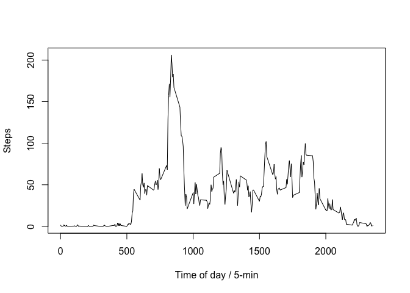

# Reproducible Research: Peer Assessment 1


## Loading and preprocessing the data

Load the dataset. Create copy without rows that don't a step count (steps = NA):

```r
dataset <- read.csv(unz("activity.zip", "activity.csv"),na.strings = "NA")
dataset_noNA <- dataset[!is.na(dataset$steps),]
summary(dataset)
```

```
##      steps                date          interval     
##  Min.   :  0.00   2012-10-01:  288   Min.   :   0.0  
##  1st Qu.:  0.00   2012-10-02:  288   1st Qu.: 588.8  
##  Median :  0.00   2012-10-03:  288   Median :1177.5  
##  Mean   : 37.38   2012-10-04:  288   Mean   :1177.5  
##  3rd Qu.: 12.00   2012-10-05:  288   3rd Qu.:1766.2  
##  Max.   :806.00   2012-10-06:  288   Max.   :2355.0  
##  NA's   :2304     (Other)   :15840
```


## What is mean total number of steps taken per day?
Calculate the total number of steps made each day and list them out in an easily readable way. Then make a histogram of the values:

```r
#Sum steps over each day
day_sums <- aggregate(x=list(steps=dataset_noNA$steps), by=list(date=dataset_noNA$date), FUN=sum)
#Print step sums
as.numeric(day_sums$steps)
```

```
##  [1]   126 11352 12116 13294 15420 11015 12811  9900 10304 17382 12426
## [12] 15098 10139 15084 13452 10056 11829 10395  8821 13460  8918  8355
## [23]  2492  6778 10119 11458  5018  9819 15414 10600 10571 10439  8334
## [34] 12883  3219 12608 10765  7336    41  5441 14339 15110  8841  4472
## [45] 12787 20427 21194 14478 11834 11162 13646 10183  7047
```

```r
#Plot values in histogram
hist(day_sums$steps, xlab = "Daily Steps (In 5000 Step Increments)", ylab="# Of Days", main="") 
```

<!-- -->

Calculate the average number of steps taken per day:

```r
avg <- sum(day_sums$steps) / length(day_sums$steps)
med <- median(day_sums$steps)
```

The Average # of Steps Per Day is: **10766.1886792** steps   
The Median # of Steps Per Day is: **10765** steps

## What is the average daily activity pattern?
Calculate the average number of steps made during each 5-min interval across all days and provide a summary of values. Then make a histogram of the values:

```r
#Average steps over each 5-min interval
int_avg <- aggregate(x=list(steps=dataset_noNA$steps), by=list(interval=dataset_noNA$interval), FUN=mean)
#Print summary of step averages
summary(int_avg$steps)
```

```
##    Min. 1st Qu.  Median    Mean 3rd Qu.    Max. 
##   0.000   2.486  34.110  37.380  52.830 206.200
```

```r
#Plot values in time series plot
plot(x=int_avg$interval, y=int_avg$steps, type="l", xlab = "Time of day / 5-min", ylab="Steps", main="") 
```

<!-- -->

Find the interval where the highest number of steps were taken on average across all days:

```r
int_max <- which.max(int_avg$steps)
```

The 5-min interval with the maximum steps taken, averaged across all days, is interval \#**104**

## Imputing missing values
Store the indicies of rows with NA step values in original raw dataset:

```r
NA_i <- which(is.na(dataset$steps))
```
There are **2304** rows with NA steps.

Create a copy of the raw dataset and replace the NA step values in the copy with the intervals average value 

```r
#Create copy of raw dataset
dataset_imp <- dataset
#Function to return up interval step average
MyReplace <- function(index){
  int_avg$steps[int_avg$interval==dataset$interval[index]]
}
#Replace all NA values with interval step average
for(item in NA_i){
  dataset_imp$steps[item] <- MyReplace(item)
}
```

Using new imputed dataset, sum steps across each day, show results in a histogram and calculate the mean and the median for both the imputed and raw dataset:

```r
#Calculate sum of steps taken each day
day_sums_imp <- aggregate(x=list(steps=dataset_imp$steps), by=list(date=dataset_imp$date), FUN=sum)
#Create a histogram of steps from the imputed data
hist(day_sums_imp$steps, xlab = "Daily Steps (In 5000 Step Increments)", ylab="# Of Days", main="")
```

<!-- -->

```r
#Calculate mean and median for raw and imputed datasets
summary_raw_data <- summarise(day_sums, Median=median(steps), Mean=mean(steps))
summary_imp_data <- summarise(day_sums_imp, Median=median(steps), Mean=mean(steps))
```
The change in **mean** between the raw data and the imputed data is: **0**  
The change in **median** between the raw data and the imputed data is: **1.1886792**

Because NA values appeared across whole days, imputing average values for the NAs did not change the mean value of total daily steps, and changed the median values minimally.

## Are there differences in activity patterns between weekdays and weekends?
Create new column identifying if day fell during the week or on a weekend:

```r
#Function which takes a list of days of the week and creates a new list labelling weekdays vs. weekends 
MyWeekday <- function(x){
  #Creates new list of TRUE and FALSE (True = weekend, False = weekday)
  tmp <- x %in% c("Saturday","Sunday")
  #Replace true and false with weekend and weekday
  tmp[tmp==TRUE] <- "weekend"; tmp[tmp==FALSE] <- "weekday"
  #Return new list
  tmp
}
#Add list created with above function to the imputed dataset
dataset_imp <- mutate(dataset_imp, Weekday = MyWeekday(weekdays(as.Date(dataset_imp$date))))
#Check to see the levels of the new column
table(dataset_imp$Weekday)
```

```
## 
## weekday weekend 
##   12960    4608
```

Calculate the average steps across invervals and day type (weekend vs weekday) and plot:

```r
#Makes a long list of step averages for each interval/weekday combination (288 x 2 = 576 rows)
averages <- aggregate(steps ~ interval + Weekday, data = dataset_imp, FUN=mean)
#Plots two time series plots of the average steps taken for each interval. One plot for weekdays one plot for weekends
ggplot(averages, aes(x = interval, y = steps)) + geom_line() + facet_grid(Weekday~.) + xlab("Interval") + ylab("Avg. Steps")
```

<!-- -->
