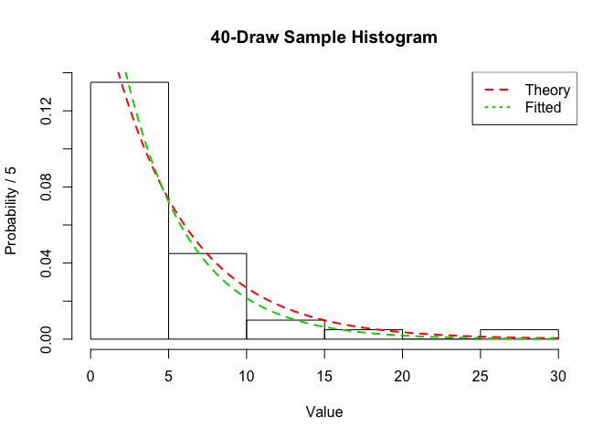
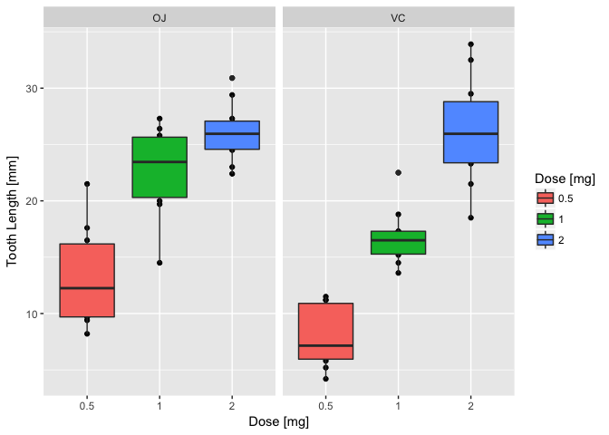

# Statistical Inference: Week 4 Peer Assignment
Alex Edward Garabedian, Ph.D.  


##Overview
###Part 1 
Part 1 of this report contains a study of the properties of sampling from an exponential function, $f(x) = \lambda{e}^{-\lambda x}$, $(x \geq 0)$, where $\lambda$ specifies the rate parameter. Such a distribution has a mean and standard deviation of $1/\lambda$. These theoretical values will be compared to the mean and variance of a 40-draw sample to the theoretical mean. Additionally, the distribution created by many 40-draw samples will be compared with a normal distribution.

###Part 2

##Part 0: Set the Seed
First, a seed is selected for the random number generator so that this work is reproducible. Any number would do, but using Leonhard Euler's birthday (15 April, 1707) seemed like an appropriate choice:

```r
set.seed(15041707)
```

##Part 1: Simulation Exercise
For this exercise, the exponential function's rate parameter, $\lambda$, is set to 0.2. From theory, both the mean and standard deviation of an exponential function with $\lambda = 0.2$ is equal to $1/\lambda = 5$. These values will be compared to a random 40-draw sample from R's internal generator.

To begin, the rate parameter is set and a 40-draw sample is generated:

```r
lambda <- 0.2
theoryMeanSD <- 1/lambda
expSample <- rexp(40, rate = lambda)
```

From the single 40-draw sample, the mean and standard deviation are calculated:

```r
expMean <- mean(expSample)
expSD <- sd(expSample)
```
The **Mean** of the 40-draw sample is: **4.8192915**

The **Standard Deviation** of the 40-draw sample is: **5.4147301**

Now, the differences with the theoretical value of **5** for both the mean and standard deviation are calculated:

```r
expMeanDiff <- 100*(theoryMeanSD-expMean)/theoryMeanSD
expSDDiff <- 100*(theoryMeanSD-expSD)/theoryMeanSD
```
The percent difference between the mean and standard deviation of this single 40-draw sample and the theoretical values are **3.6%** and **-8.3%**, respectively.

The histogram created from this 40-draw sample should follow the exponential curve (since that is where the numbers came from originally). Additionally, a fit to the histogram values to an exponential function can be performed, and the fitted value for the rate parameter can be compared with the value used to generate the sample:

```r
# Calculate the number of breaks needed to span the sample with bins of width 1/lambda = 5
# Then create the histogram
histBreaks <- c((1:ceiling(max(expSample)/5 + 1))*5)-5 
expHist <- hist(expSample, prob=TRUE, main = "40-Draw Sample Histogram", xlab = "Value", ylab = "Probability / 5", breaks = histBreaks)
#Fit the histogram to exponential function, extract the fitted rate paramter
histDF <- data.frame(xval = expHist$mids, yval = expHist$density)
expFit <- nls(formula = yval ~ beta*exp(-beta * xval), data = histDF, start = list(beta = .2))
lambdaFit <- summary(expFit)$parameters[1,1]
#Add Theory and Fitted curves to histogram
curve(dexp(x, rate = 0.2), col = 2, lty = 2, lwd = 2, add = TRUE) #Theory
curve(dexp(x, rate = lambdaFit), col = 3, lty = 2, lwd = 2, add = TRUE) #Fitted
legend("topright", c("Theory", "Fitted"), col=c(2, 3), lwd=c(2,2), lty = c(2, 3))
```

<!-- -->

**Rate Parameter Comparison**

Theory: **0.2**, Fitted: **0.2415253**, Percent Diff: **-20.8%**

The distribution created from the means of many 40-draw samples should approximate a normal distribution. To show this, a histogram of 1000 such sample means is created and a normal distribution is fit to the histogram:

```r
# Calculate means of 1000 40-draw samples from exp function and create a histogram
mns = NULL
for (i in 1 : 1000) mns = c(mns, mean(rexp(40, rate = lambda)))
normHist <- hist(mns, prob=TRUE, xlab="40-draw sample mean", ylab="Probability", main="Distribution of 40-Draw Sample Means")
# Fit Histogram to a normal function and overlay the fitted function on the histogram
normHistDF <- data.frame(xval = normHist$mids, yval = normHist$density)
normFit <- nls( formula = yval ~ (1/(2*pi*sigma^2)^.5)*exp(-(xval-mu)^2/(2*sigma^2)), start=c(mu=theoryMeanSD,sigma=theoryMeanSD/sqrt(40)) , data = normHistDF)
fitParams <- summary(normFit)$parameters[,1:2]
fitParams
```

```
##        Estimate Std. Error
## mu    4.9198717 0.01977312
## sigma 0.8389734 0.01615501
```

```r
curve(dnorm(x, mean = fitParams[["mu",1]], sd = fitParams[["sigma",1]] ), col = 2, lty = 2, lwd = 2, add = TRUE) #Theory
```

<!-- -->

The histogram and overlayed fit to a normal distribution show that the distribution of 40-draw sample means closely approximates a normal distribution with **mean = 4.9198717** and **sigma = 0.8389734**. These values should be compared with the theoretical values of **$1/\lambda = \boldsymbol{5}$** and **$1/\lambda * 1/\sqrt{40} \approx \boldsymbol{0.79}$** for the mean and standard deviation respectively.

##Part 2: Basic Inferential Data Analysis


```r
head(ToothGrowth)
```

```
##    len supp dose
## 1  4.2   VC  0.5
## 2 11.5   VC  0.5
## 3  7.3   VC  0.5
## 4  5.8   VC  0.5
## 5  6.4   VC  0.5
## 6 10.0   VC  0.5
```

```r
summary(ToothGrowth$len)
```

```
##    Min. 1st Qu.  Median    Mean 3rd Qu.    Max. 
##    4.20   13.08   19.25   18.81   25.28   33.90
```

```r
levels(ToothGrowth$supp)
```

```
## [1] "OJ" "VC"
```

```r
as.numeric(levels(as.factor(ToothGrowth$dose)))
```

```
## [1] 0.5 1.0 2.0
```

```r
qplot(x=as.factor(dose), y=len, data=ToothGrowth, facets=~supp, xlab="Dose [mg]", ylab="Tooth Length [mm]") +
  geom_boxplot(aes(fill = as.factor(dose))) +
  scale_fill_discrete(name="Dose (mg)")
```

<!-- -->


